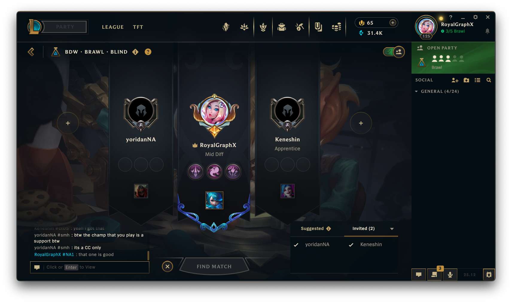
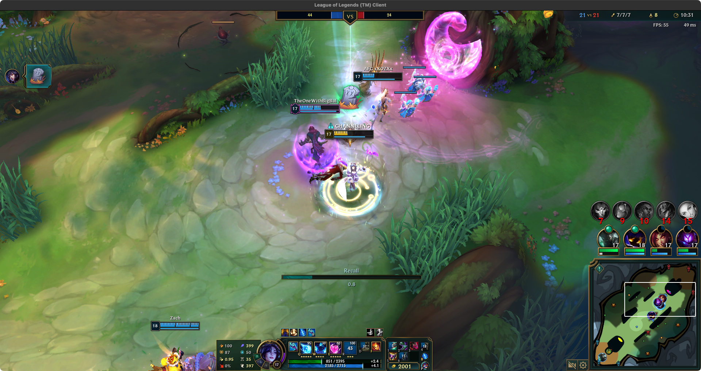
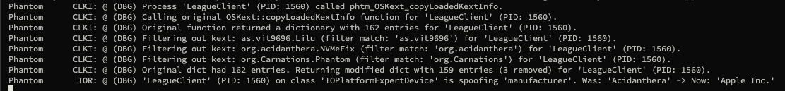

<h1 align="center">Phantom</h1>

<h5 align="center">Danny is that you?</h5>
</br>

> [!CAUTION]
> This kernel extension has a LICENSE that prohibits its inclusion in any form of prebuilt EFIs and redistribution outside of this official repository. Read the LICENSE carefully, before you decide to make a decision that can lead to a DMCA of your repository, whatever it may be. You are granted access to Phantom through this official repository **only**.





</br>



</br>

A [Lilu](https://github.com/acidanthera/Lilu) plug-in that hides identifying information, relative to determining if the current machine XNU is running on is a real Mac, or not.

</br>
<h1 align="center">Purpose</h1>
</br>

This kernel extension was developed specifically to circumvent various methods used to detect whether or not a machine running macOS, was a genuine Macintosh, or a regular PC using OpenCore. Various applications such as League of Legends, do not allow Virtual Machines, or PCs using OpenCore to boot macOS on their platforms. There are other known softwares that should equally be covered, but yes this will allow you to play League of Legends. Carnations Botanica does **NOT** support cheating, hacking, scripting, or any modifications to the League Client. 

This was created by a legitimate player who also has spent too much money on skins, check my account.

</br>
<h1 align="center">Support Chart</h1>
</br>

| Release Name | Status | Notes |
| --- | --- | --- |
| Tahoe (26+) | <span style="color: #a80000;">Incomplete</span> | Waiting on Lilu update. |
| Sequoia (15+) | <span style="color: #7afc4e;">Complete</span> | All Modules work. |
| Sonoma (14+) | <span style="color: #7afc4e;">Complete</span> | All Modules work. |
| Ventura (13+) | <span style="color: #ffe985;">Work-In-Progress</span> | Untested. May Work. |
| Monterey (12+) | <span style="color: #ffe985;">Work-In-Progress</span> | Untested. May Work. |
| Big Sur (11+) | <span style="color: #ffe985;">Work-In-Progress</span> | Untested. May Work. |
| Catalina (10.15+) | <span style="color: #ffe985;">Work-In-Progress</span> | Untested. May Work. |
| Mojave (10.14+) | <span style="color: #ffe985;">Work-In-Progress</span> | Untested. May Work. |
| High Sierra (10.13+) | <span style="color: #a80000;">Incomplete</span> | Waiting on Internal Testing. |

The currently Complete versions are the ones that we were able to internally test, and will continue to update this kernel extension in the upcoming following days, to ensure all versions of macOS that League of Legends can run on, is supported. Give us time to make sure things work internally first. If you'd like to help, please read further below and create an Issue with your testing environment and logs. Thanks for the patience.

</br>
<h1 align="center">Financial Support</h1>
</br>

When it came to developing this kernel extension, the amount of time it took to develop since that fateful wednesday Vanguard was enabled server-side, was mainly because I did not have enough time to sit down and work on it.

If you'd like to help me out financially, to both incentivize further development, but to essentially to fund the time and research required when MVG eventually gets updated, and the kernel extension is required to update as well.

If you would like to be kind, and donate so that development can continue smoothly without interruption you can use the following methods of direct tipping.

1. [CashApp](https://cash.app/$RoyalGraphX)
1. [PayPal](https://paypal.me/RoyalGX0)
1. [Ko-Fi](https://ko-fi.com/royalgraphx)

Tipping/Donating is not required, but will greatly assist me with day to day life, including but not limited to medical expenses, and monthly bills. Look, no one enjoys "begging for money" but this genuinely took a lot of my personal free time away, when I wasn't at work, to create and test alone since MVG was enabled.

</br>
<h1 align="center">Usage / Features</h1>
</br>

### Usage

**To use Phantom, you must be using [the latest version of Lilu](https://github.com/acidanthera/Lilu/releases) (atleast 1.7.0+ required) to properly load the plug-in.**

### Features

Phantom will automatically reroute various kernel functions to our own custom functions, that will process the currently asking PID for context about its requests. If the process is found to be in our known filters, we act accordingly and provide sanatized data to the requesting processes.

1. VMM Status - If you're on baremetal, or in a KVM you will always report 0 for VMM status. You will automatically be able to use incremental updates via OTA. This feature is merged from RestrictEvents and is automatically enabled for all Phantom users.

2. Secure Level Status - Phantom will selectively report if SIP is enabled or disabled to specific processes that need SIP to function.

3. KextManager Information - When a process asks what kernel extensions are loaded, we first sanitize the list, and return a modified dictionary. Phantom even hides itself!

4. IORegistry Cleansing - When a process asks to probe the IOReg for hardware/device information, we return crafted data that resembles an official Mac computer.

5. CSR Active Configuration - Some processes ask for SIP via a programatical csr-active-config probe. This equally returns the expected masks to state SIP enabled/disabled.

</br>

### Debugging, Bug Reporting, Contributing to Filter.

If you find that you're running into issues that must be reported, or wish to contribute to the list of processes that should not be aware of being in an OpenCore-style environment you can follow the below information to better provide logs for us to improve the project with. Report these to the DarwinKVM discord server for now.

</br>
<b>Example boot-args for <i>Developers/Contributors</i> (This is not required to use Phantom)</b>

```bash
-v debug=0x100 -liludbgall
```

</br>
<h1 align="center">Contributing to the Project</h1>

<h4 align="center">If you have any changes or improvements you'd like to contribute for review and merge, to update conventional mistakes or for QoL, as well as maybe even adding whole new features, you can follow the general outline below to get a local copy of the source building.</h4>

</br>

1. Install/Update ``Xcode``
    - Visit https://xcodereleases.com/ for your appropriate latest version.

2. Prepare source code
    - ``git clone --recursive https://github.com/Carnations-Botanica/Phantom.git``
    - Get the latest ``DEBUG`` Lilu.kext from [Releases](https://github.com/acidanthera/Lilu/releases) and update your EFI with it. Example Repository contents below.
        - Phantom/VMHide.xcodeproj <- Xcode Project file.
        - Phantom/Phantom/ <- Project Contents.
        - Phantom/MacKernelSDK <- Gotten by using ``--recursive``.
        - Phantom/Lilu <- Gotten by using ``--recursive``.
        - Phantom/README.md <- How you can tell you're in the root.

3. Launch ``.xcodeproj`` with Xcode to begin!
    - ``kern_start.cpp`` - Contains main Orchestrator for initializing various modules of reroutes.
    - ``kern_start.hpp`` - Header for Main, sets up various macros and globals and the PHTM class.
    - ``kern_vmm.cpp`` - Automatically represents the current machine as NOT a virtual machine, but reports YES to various processes.
    - ``kern_vmm.hpp`` - Header for VMM module, sets up various functions as globals.
    - ``kern_ioreg.cpp`` - Cleans the IORegistry data when a requesting process is probing for information.
    - ``kern_ioreg.hpp`` - Header for IOR module.
    - ``kern_securelevel.cpp`` - Decides whether or not to report SIP as enabled or disabled based on process asking.
    - ``kern_securelevel.hpp`` - Header for the SLP module.
    - ``kern_kextmanager.cpp`` - Cleans up the currently loaded kernel extensions data when a process asks for it.
    - ``kern_kextmanager.hpp`` - Header for the KMP module.
    

<br>
<h1 align="center">Special Thanks!</h1>
<br>

[<b>RoyalGraphX</b>](https://github.com/RoyalGraphX) - Lead Developer, Reworked VMHide to Phantom.

[<b>Cat1Bot</b>](https://github.com/Cat1Bot) - Assisted with checking function names and demangling them.

[<b>Nyabsi</b>](https://github.com/Nyabsi) - Assisted with checking function names and demangling them.

[<b>Lilu</b>](https://github.com/acidanthera/Lilu) - The patching engine that makes this kernel extension possible.

[<b>MacKernelSDK</b>](https://github.com/acidanthera/MacKernelSDK) - An amazing SDK used to standardize the usage of various kernel APIs across multiple versions of OS X / macOS. Makes this kernel extension possible.

<h6 align="center">A big thanks to all contributors and future contributors! ꩓</h6>
